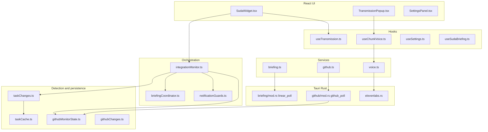
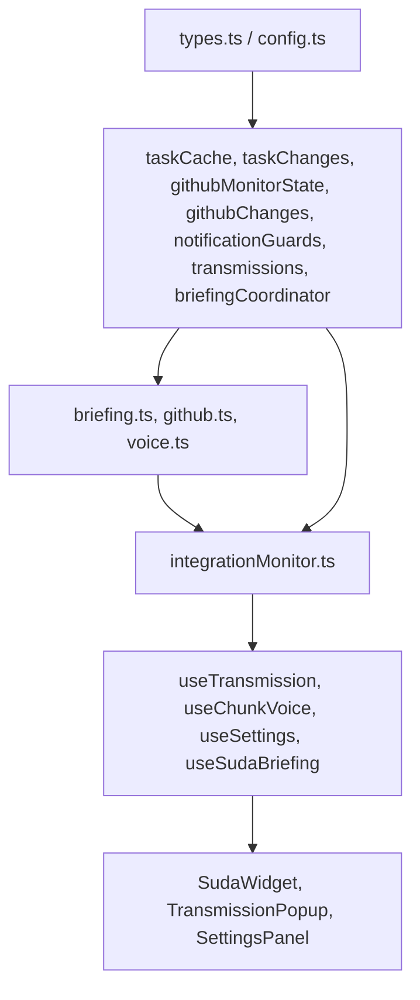
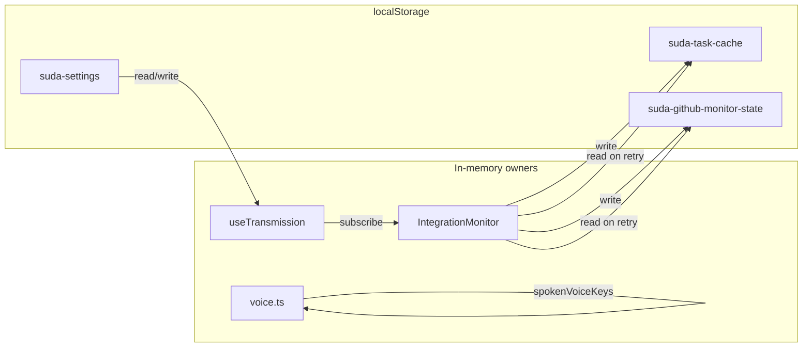

# Architecture

## High-level architecture

| Diagram node | Code mapping | Verification |
|---|---|---|
| `SudaWidget.tsx` | `src/components/SudaWidget.tsx` | Root widget component |
| `IntegrationMonitor` | `src/services/integrationMonitor.ts` | Singleton `integrationMonitor` |
| `BriefingCoordinator` | `src/lib/briefingCoordinator.ts` | `createBriefingEvents`, `buildCombinedBriefing` |
| `NotificationGuards` | `src/lib/notificationGuards.ts` | Central guard predicates |
| `TaskChanges` | `src/lib/taskChanges.ts` | `detectTaskChanges` |
| `GitHubMonitorState` | `src/lib/githubMonitorState.ts` | `load/saveGitHubMonitorState` |
| `VoiceService` | `src/services/voice.ts` | `speakText`, `canInvokeElevenLabs` |
| `LinearPoll` | `src-tauri/src/briefing/mod.rs` | Tauri `linear_poll` command |
| `GitHubPoll` | `src-tauri/src/github/mod.rs` | Tauri `github_poll` command |
| `ElevenLabs` | `src-tauri/src/elevenlabs.rs` | Tauri `elevenlabs_tts` command |

## Component ownership

| Layer | Responsibility | Key files |
|---|---|---|
| Rust | API calls, GitHub detection, TTS proxy | `src-tauri/src/briefing/`, `src-tauri/src/github/`, `elevenlabs.rs` |
| Services | Tauri invoke wrappers | `src/services/briefing.ts`, `github.ts`, `voice.ts` |
| Pure lib | Guards, detection, formatting, persistence | `src/lib/*` |
| Orchestration | Polling lifecycle, status, presentation gate | `src/services/integrationMonitor.ts` |
| React | Display, settings, user gestures | `src/components/`, `src/hooks/` |

## State ownership

| State | Owner | Persisted in | Main readers | Main writers |
|---|---|---|---|---|
| Linear task snapshots | `IntegrationMonitor.taskCache` via `taskCache.ts` | `localStorage` `suda-task-cache` | `detectTaskChanges` | successful Linear poll, `establishBaselineFromTasks` |
| GitHub processed events | `IntegrationMonitor.githubState` via `githubMonitorState.ts` | `localStorage` `suda-github-monitor-state` | Rust `filter_and_update_state` | successful GitHub poll |
| Integration status | `IntegrationMonitor` (`linear`, `github` runtime) | memory | `SettingsPanel` | poll and retry flows |
| Polling timer | `IntegrationMonitor.unifiedTimerId` | memory | `scheduleNext` | `initialize`, `stop`, `manualRetry` |
| Poll-in-flight flags | `IntegrationMonitor` per integration + `cycleInFlight` | memory | `pollLinear`, `pollGitHub` | same (`finally` release) |
| Retry/backoff | `IntegrationMonitor.failureCount` | memory | `getBackoffDelayMs` | `applyLinearResult`, `applyGitHubResult` |
| Transmission dedup IDs | `IntegrationMonitor.presentedTransmissionIds` | memory | `presentEvents` | successful presentation |
| Spoken voice keys | `voice.ts` `spokenVoiceKeys` | memory | `canInvokeElevenLabs` | successful speech |
| Voice settings | `useSettings` → `voice.ts` mute sync | `localStorage` `suda-settings` | `TransmissionPopup`, `voice.ts` | Settings panel |
| Current transmission | `useTransmission` state | memory | `TransmissionPopup` | `showTransmission` |

## Frontend dependency direction

Rules enforced:

- `voice.ts` does not import React components
- `briefingCoordinator.ts` does not call ElevenLabs
- Persistence modules do not open transmissions
- `notificationGuards.ts` has no service or UI imports

## State ownership flow

