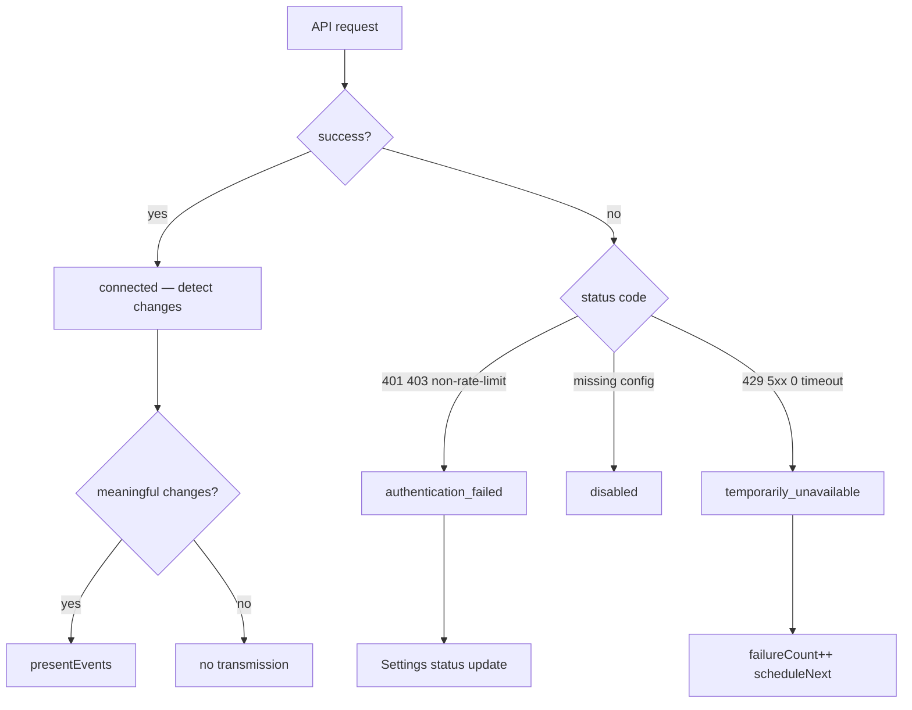

# Error Handling

## Error classification

| HTTP / condition | Integration status | Auto-retry | Transmission |
|---|---|---|---|
| Missing config | `disabled` | No | No |
| 401, 403 (auth) | `authentication_failed` | No (until manual retry) | No |
| 403 rate limit | `temporarily_unavailable` | Yes (reset-aware backoff) | No |
| 429 | `temporarily_unavailable` | Yes | No |
| 5xx | `temporarily_unavailable` | Yes | No |
| Timeout (30s) | `temporarily_unavailable` | Yes | No |
| Network error | `temporarily_unavailable` | Yes | No |
| Connected, no changes | `connected` | Yes (normal interval) | No |
| Connected, changes | `connected` | Yes | Yes |

## Circuit breakers

- `authFailed` flag per integration pauses that integration's polling
- `scheduleNext()` skips integrations with `authFailed` or `disabled`
- Manual retry clears `authFailed` and `failureCount`

## Backoff schedule

`getBackoffDelayMs(failureCount, intervalMs)`:

| failureCount | Delay |
|---|---|
| 0 | poll interval (max of active integrations) |
| 1 | 60s |
| 2 | 5m |
| 3+ | 15m |

GitHub rate-limit reset: `rateLimitResetAt` from API (ms) may extend delay beyond backoff.

## Error routing diagram

## Logging

Format: `[SUDA][Linear]`, `[SUDA][GitHub]`, `[SUDA][Voice]`, `[SUDA][Monitor]`

- `logOnce` prevents repeated identical errors
- `logOnStateChange` logs status transitions once
- No API keys or auth headers in logs
- Error bodies truncated to 300 chars in Rust
- Dev-only verbose logs in frontend (`import.meta.env.DEV`)

## UI status reporting

- `IntegrationMonitor.emitStatus()` → `SettingsPanel` integration statuses
- Auth warnings shown once per session in settings message field
