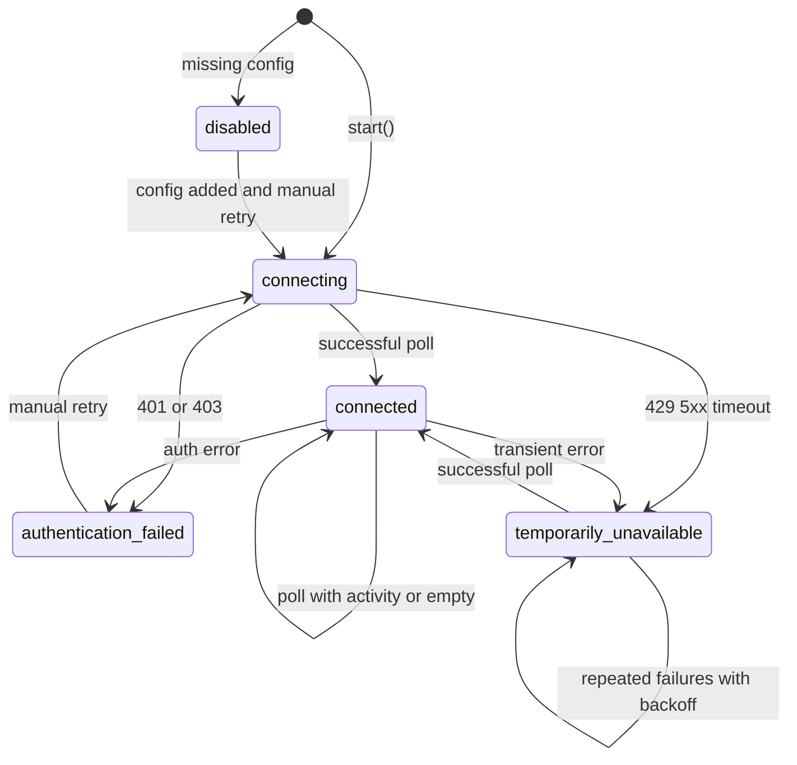

# Integrations

## Integration state diagram

| Diagram state | Code mapping | Verification |
|---|---|---|
| `disabled` | `IntegrationStatus.disabled` | Missing API key or GitHub config |
| `connecting` | Set in `initialize()` | `integrationMonitor.ts` |
| `connected` | `applyLinearResult` / `applyGitHubResult` | On successful poll |
| `authentication_failed` | `authFailed = true` | Polling paused until manual retry |
| `temporarily_unavailable` | `failureCount++` | Bounded backoff via `getBackoffDelayMs` |

---

## Linear

### Authentication

- Env: `LINEAR_API_KEY` (required to enable)
- Env: `LINEAR_AUTH_TYPE` — `personal_api_key` (default) or `oauth`
- Personal keys: raw key in `Authorization` header (no `Bearer`)
- OAuth tokens: `Bearer` prefix added in `src-tauri/src/integrations/linear_auth.rs`

### API flow

1. Frontend `fetchLinearPoll()` → Tauri `linear_poll`
2. Rust GraphQL `fetch_my_issues` — top 25 assigned open issues by `updatedAt`
3. Frontend `detectTaskChanges()` compares fingerprints against `suda-task-cache`

### Poll interval

- Linear uses 60s base interval (unified with GitHub via `Math.max`)

### Baseline behavior

- First poll with `baselineEstablished: false` → snapshots saved, no transmission
- `SudaWidget` also calls `establishBaselineFromTasks` from cached briefing

### Meaningful events

- New task assigned
- Title, description, status, priority, due date, assignee changes
- Due soon (today, tomorrow, overdue) — once per `announcedDueSoonKey`
- **Not** `updatedAt`-only changes

### Permanent failures

- 401/403 → `authentication_failed`, polling paused, settings warning

### Temporary failures

- 429, 5xx, network timeout (30s) → `temporarily_unavailable`, backoff 60s / 5m / 15m

### Manual retries

- Settings "Retry Linear" → `integrationMonitor.retryLinear()`

### Known limitations

- Only top 25 issues by `updatedAt` are monitored
- Tasks outside that window are not detected

---

## GitHub

### Authentication

- Requires `GITHUB_TOKEN`, `GITHUB_OWNER`, and non-empty `GITHUB_REPOSITORIES`
- Token stays in Rust — never exposed to browser bundle

### API flow

1. `fetchGitHubPoll(state)` → Tauri `github_poll`
2. Per repo: events (30), branches (100), optional pulls (20)
3. `filter_and_update_state` deduplicates and establishes baseline

### Poll interval

- `GITHUB_POLL_INTERVAL_SECONDS` (default 60, minimum 15)

### Baseline behavior

- First successful poll: all event IDs recorded, **no notifications**

### Meaningful events

- Push, force-push, branch created, PR opened/updated/synchronized, PR merged
- Force-push wording: "likely following a rebase or history rewrite" (never confirms rebase)

### Permanent failures

- 401/403 (non-rate-limit) → `authentication_failed`

### Temporary failures

- 429, 5xx, rate-limit 403, timeout → `temporarily_unavailable`
- Rate-limit reset header used for backoff delay when present

### Manual retries

- Settings "Check GitHub" → `integrationMonitor.checkGitHubNow()`

### Known limitations

- Events API limited to 30 items per page
- Branch heads paginated at 100
- **Atomic poll**: one repository failure aborts the entire GitHub poll for that cycle
- `GITHUB_NOTIFY_PULL_REQUESTS` defaults to `false` when unset; `.env.example` sets `true`
