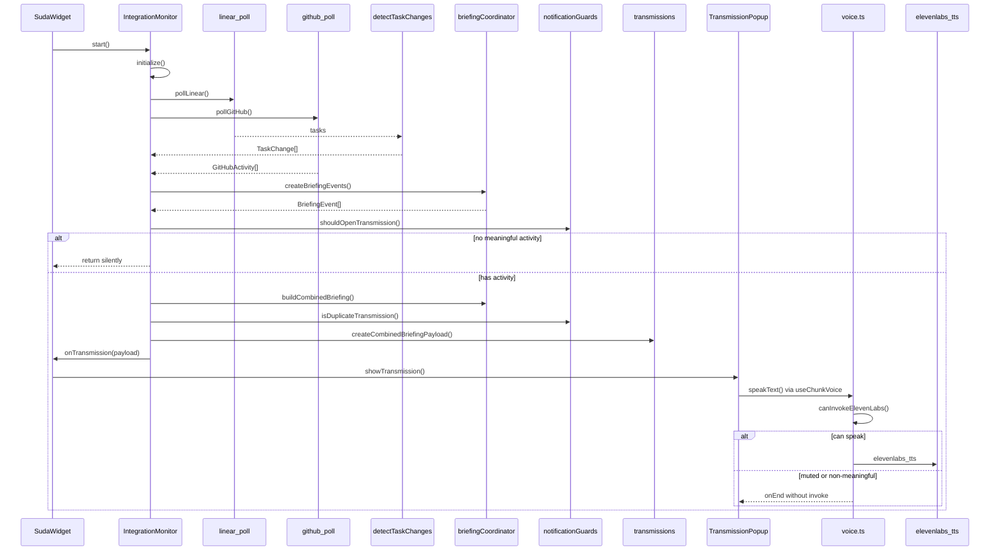

# Notification Flow

## Sequence diagram

| Diagram element | Code mapping | Verification |
|---|---|---|
| `IntegrationMonitor` | `src/services/integrationMonitor.ts` | `runUnifiedPollCycle`, `presentEvents` |
| `linear_poll` | `src-tauri/src/briefing/mod.rs` | `fetchLinearPoll()` |
| `github_poll` | `src-tauri/src/github/mod.rs` | `fetchGitHubPoll()` |
| `detectTaskChanges` | `src/lib/taskChanges.ts` | Called from `pollLinear` |
| `notificationGuards` | `src/lib/notificationGuards.ts` | `shouldOpenTransmission`, dedup |
| `createCombinedBriefingPayload` | `src/lib/transmissions.ts` | `kind: meaningful-activity` |
| `canInvokeElevenLabs` | `src/services/voice.ts` | Final gate before Tauri invoke |

## Decision: whether a transmission opens

| Condition | Result |
|---|---|
| `events.length === 0` | No transmission |
| `buildCombinedBriefing` returns null | No transmission |
| `isDuplicateTransmission(dedupKey)` | No transmission |
| `authentication_failed` on poll | No transmission; settings status only |
| `temporarily_unavailable` on poll | No transmission; backoff scheduled |
| First baseline poll (no changes) | No transmission |
| Manual refresh with no changes | No transmission |
| Meaningful Linear and/or GitHub activity | One combined transmission |

## Decision: whether ElevenLabs is called

| Condition | ElevenLabs |
|---|---|
| `payload.kind !== "meaningful-activity"` | Never |
| `payload.voiceEnabled === false` | Never |
| `settings.muteVoice === true` | Never |
| `voiceMessage.trim().length === 0` | Never |
| `hasSpokenVoiceKey(dedupKey)` | Never |
| All gates pass | `elevenlabs_tts` invoked once |

## Decision: whether browser voice is called

| Condition | Browser fallback |
|---|---|
| ElevenLabs succeeds | No |
| `settings.fallbackVoice === false` | No |
| ElevenLabs fails or not configured | Yes, once per dedup key |
| Non-meaningful payload | No |
