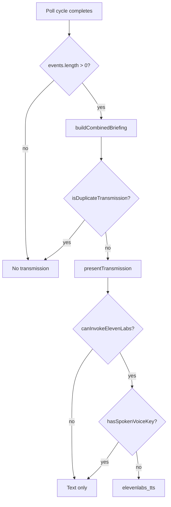

# State and Deduplication

## Persistence schema versions

| Store | Key | Version | Current |
|---|---|---|---|
| Linear task cache | `suda-task-cache` | `version` field | `1` |
| GitHub monitor state | `suda-github-monitor-state` | `version` field | `1` |
| Activity overflow history | `suda-activity-history` | none | capped at 100 |
| Settings | `suda-settings` | none | — |

## Linear task fingerprints

Fingerprint fields (joined by `|`): title, description, status, priority, dueDate, assignee.

`updatedAt` is tracked separately — changes without fingerprint diff are silent.

## GitHub processed event IDs

- Stored in `processedEventIds`
- Capped at **500** (Rust `trim_processed_ids`, frontend load cap)
- Format examples: `repo:12345` (event), `repo:sha:abc` (branch head fallback)

## Branch-head tracking

- Key: `{repo}:{branch}` → commit SHA
- Baseline: records heads without notification
- SHA change without push event → synthetic push activity

## PR snapshots

- Key: `{repo}:pr:{number}` → `updated_at` timestamp
- Prevents duplicate PR update notifications across events and pulls endpoints

## Baseline rules

| Integration | First successful poll |
|---|---|
| Linear | `detectTaskChanges` with `!baselineEstablished` → snapshots only |
| GitHub | `filter_and_update_state` with `!baselineEstablished` → mark IDs processed, notify `[]` |

## Merge/push suppression

`dedupe_merge_and_push` in Rust:

- Suppresses non-forced push to base branch when merge exists on same repo/branch
- Suppresses SHA push when merge commit SHA matches

## Due-soon deduplication

- Key: `{taskId}:{dueDate}` stored in `announcedDueSoonKey`
- Same task will not re-announce due-soon until due date changes

## Duplicate trace table

| Duplicate source | Deduplication key | Preferred event |
|---|---|---|
| PR merge + base push | merge commit SHA + `dedupe_merge_and_push` | PR merged |
| GitHub events + pulls endpoint | `processedEventIds` + `prSnapshots` | latest normalized PR event |
| Commit in push + branch-head SHA | `processedEventIds`; SHA suppressed if merge SHA matches | push event |
| React rerender | `transmissionId` / `presentedTransmissionIds` | first presentation only |
| Voice rerender | `spokenVoiceKeys` / dedup key | first speech only |
| Due-soon repeat poll | `announcedDueSoonKey` | once per due window |
| Manual refresh same changes | `presentedTransmissionIds` | no re-open |

## Deduplication flowchart

## Resource limits

| Resource | Limit |
|---|---|
| GitHub processed IDs | 500 |
| Activity history | 100 messages |
| Spoken voice keys | 200 (FIFO) |
| Presented transmission IDs | 100 (FIFO) |
| Briefing events per transmission | 5 (`MAX_BRIEFING_EVENTS`) |

## Recovery

- Invalid JSON → empty defaults (no crash)
- Missing `version` → migrated to `1`
- Oversized `processedEventIds` → trimmed on load/save
