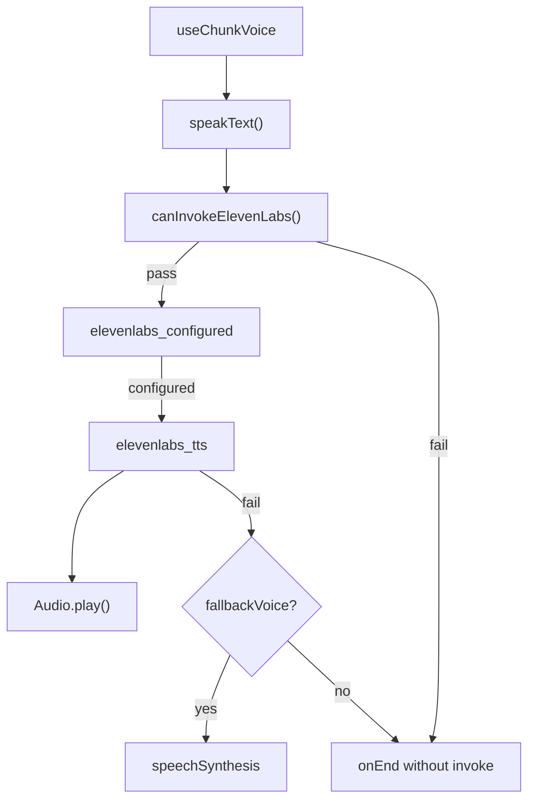

# Voice System

## Voice eligibility gate

```typescript
// src/services/voice.ts — canInvokeElevenLabs()
payload.kind === "meaningful-activity"
&& payload.voiceEnabled === true
&& !muted
&& voiceMessage.trim().length > 0
&& !hasSpokenVoiceKey(dedupKey)
```

UI layer also applies `canInvokeVoice()` in `notificationGuards.ts` before `showTransmission`.

## ElevenLabs request flow



| Diagram node | Code mapping | Verification |
|---|---|---|
| `useChunkVoice` | `src/hooks/useChunkVoice.ts` | Calls `speakText` with dedup key |
| `canInvokeElevenLabs` | `src/services/voice.ts` | Blocks idle/status/auth payloads |
| `elevenlabs_tts` | `src-tauri/src/elevenlabs.rs` | API key server-side only |

## Muted state

- `settings.muteVoice` synced to `voice.ts` via `muteVoice()`
- `canInvokeVoice` returns false → text still shown in popup

## Browser fallback

- Enabled by `settings.fallbackVoice`
- Only when ElevenLabs fails or is not configured
- One fallback per dedup key (no double speech)

## Credit protection

ElevenLabs is **never** called for:

- Idle summon (`kind: idle`)
- Status/checking/error payloads (`kind: status`)
- Authentication warnings
- Temporary failure status updates
- Empty polling results
- Duplicate transmissions (`spokenVoiceKeys`, `presentedTransmissionIds`)
- Muted voice

## Voice deduplication

- `transmissionId` on payload (from event IDs + voice message)
- `spokenVoiceKeys` in `voice.ts` (cap: 200, FIFO eviction)
- `speakGeneration` cancels stale playback on new speech

## Failure behavior

| Scenario | Behavior |
|---|---|
| ElevenLabs not configured | Text only; browser fallback if enabled |
| ElevenLabs request fails | Text only; browser fallback if enabled |
| Audio playback blocked | Hint in dev logs; fallback if enabled |
| Browser unavailable | Text only, `onEnd` called |
